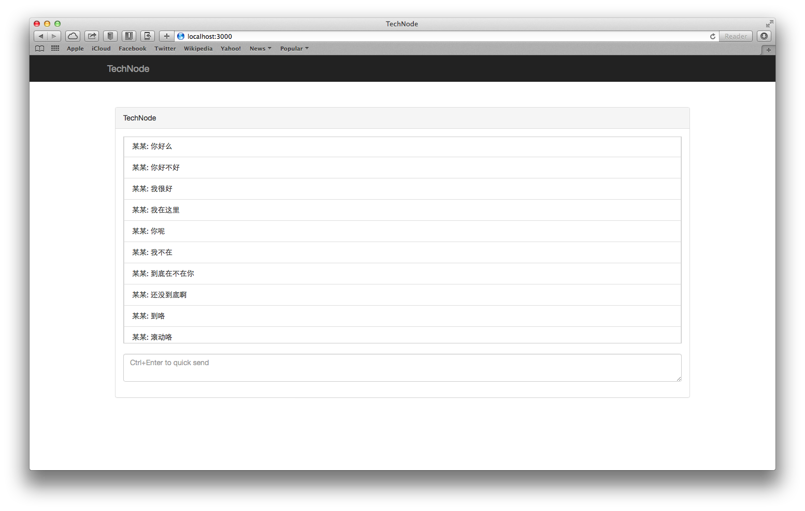

## 最简单的聊天室

我们将使用socket.io和Angular.js从零开始，搭建一个多人的多房间聊天室。将会带着大家使用socket.io和Angular实现一个单页应用（SPA），通过本章的学习，读者将会了解如何把node与前端的开发框架结合起来，体会前端开发流程，快速实现Web应用。

### socket.io简介

HTML5引入了很多新的特性，WebSocket就是其中之一，它为浏览器端和服务器端提供了一个基于TCP链接的双向通道，这样Web开发人员可以使用WebSocket构建真实的实时Web应用。但是并不是所有的浏览器都支持WebSocket特性，在不支持WebSocket的浏览器中，我们可以使用一些其他的方法来实现实时通信，例如：轮询、长轮询、基于流或者Flash Socket的实现。socket.io出现就是为了磨平浏览器的差异，为开发者提供一个统一的接口，在不支持WebSocket的浏览器中，socket.io可以降级为其他通信方式来实现实时通信。下面是socket.io所使用的实时通信方式列表：

- Websocket
- Adobe® Flash® Socket
- AJAX long polling
- AJAX multipart streaming
- Forever Iframe
- JSONP Polling

在开发过程中，我们甚至可以指定使用某种通信方式。

### Angular.js

Angular.js是新一代前端MVC框架。与Backbone.js相比，它完全实现了数据层和视图层的双向绑定，开发人员可以专注于功能开发，而无需纠缠在繁琐的DOM操作之中，这也正式选择它的原因。除此之外，Angular.js社区非常活跃，有大量的文档和组件。废话休说，让我开始吧！

### 开始

新建`TechNode`目录，使用`npm init`初始化, 生成`package.json`文件：

```
$ mkdir TechNode && cd TechNode && npm init
```

有了package.json文件，我们就可以轻松地管理项目的依赖。


### 使用express搭建服务器

想必你应该很清楚如何使用express搭建服务器了，下面是TechNode的服务器，文件名为app.js，直接放在TechNode下面：

```
var express = require('express')
var app = express()
var port = process.env.PORT || 3000

app.use(express.static(__dirname + '/static'))

app.use(function (req, res) {
  res.sendfile('./static/index.html')
})

var io = require('socket.io').listen(app.listen(port))

io.sockets.on('connection', function (socket) {
  socket.emit('connected')
})

console.log('TechNode  is on port ' + port + '!')
```


我们将静态文件放在`staitc`目录下，包括`index.html`，我们不使用`jade`来生成html页面，而是直接使用html文件。

```
app.use(express.static(__dirname + '/static'))
```

除了静态文件的请求意外，其他所有的HTTP请求，我们都转发到`index.html`，服务端不关心路由，所有的路由逻辑都交给客户端的Angular.js去处理。

```
app.use(function (req, res) {
  res.sendfile('./static/index.html')
})
```

接下来就是建立服务端与浏览器端的socket服务。socket.io的API是基于事件的，我们监听着`connected`事件，如果有客户端链接上来，我们就可以获得一个socket对象，这样我们就可以和这个客户端实时通信了。

```
var io = require('socket.io').listen(app.listen(port))

io.sockets.on('connection', function (socket) {
  socket.emit('connected')
})
```

新建`static`目录，添加`index.html`文件：

```
<!doctype html>
<html lang="en">
  <head>
    <meta charset="UTF-8">
    <title>TechNode</title>
    <script type="text/javascript" src="/socket.io/socket.io.js"></script>
  </head>
  <body>
    <script type="text/javascript">
      var socket = io.connect('/')
      socket.on('connected', function () {
        alert('connected to TechNode!')
      })
    </script>
  </body>
</html>
```

为了与服务端的socket.io通信，我们必须在客户端引入socket.io提供的客户端代码`socket.io.js`。这个文件并不是我们手动添加到`static`目录的，socket.io自己响应了这个请求。当然，你可以将这个文件保存下来，从别的地方引用。

```
var socket = io.connect('/')
socket.on('connected', function () {
  alert('connected to TechNode!')
})
```

调用`io.connect`，传入socket服务器，因为在本例中，socket服务器与静态服务器是同一个，可以简写为`/`（实际上相当于`http://localhost:3000`），获得一个socket对象，然后就可以和服务端通信了。


别忘了使用`npm install express socket.io --save`安装`express`和`socket.io`，参数`--save`可以自动更新package.json文件，将express和socket.io的依赖加进去。

服务器搭建好了，运行：

```
$ node app.js 
```

`TechNode is on port 3000!`，访问`http://localhost:3000`，试试看。

### 最简单的聊天室

#### 使用Bootstrap和Angular.js

我们使用`bower`来做前端类库的管理，首先新建`bower.json`文件，用来管理TechNode前端依赖的第三方库，运行`bower init`命令，回答一些问题，可以自动帮你生成bower.json文件。

新建.bowerrc文件，添加如下内容，为bower指定包的安装目录：

```
{
  "directory" : "static/components"
}
```

接下来，试用`bower`安装我们需要的一些前端组件：

- bootstrap：快速构建web项目的前端UI库，包含了jquery；
- angular：我们的主角，前端MVC框架。

```
bower install bootstrap angular --save
```

将这些类库引入到index.html中：

```
<head>
  <meta charset="UTF-8">
  <title>TechNode</title>
  <link rel="stylesheet" href="/components/bootstrap/dist/css/bootstrap.min.css">
  <script type="text/javascript" src="/socket.io/socket.io.js"></script>
  <script type="text/javascript" src="/components/jquery/jquery.js"></script>
  <script type="text/javascript" src="/components/bootstrap/dist/js/bootstrap.min.js"></script>
  <script type="text/javascript" src="/components/angular/angular.js"></script>
</head>
```

#### 搭建聊天室

使用html和angular将TechNode的外观搭建出来：

```
<head>
  ...
  <link rel="stylesheet" href="/styles/room.css">
  ...
</head>
<body>
  <div class="navbar navbar-inverse navbar-fixed-top">
    <div class="container">
      <div class="navbar-header">
        <a class="navbar-brand" href="#">TechNode</a>
      </div>
    </div>
  </div>
  <div class="container" style="margin-top:100px;">
    <div class="col-md-12">
      <div class="panel panel-default room">
        <div class="panel-heading room-header">TechNode</div>
        <div class="panel-body room-content">
          <div class="messages">
            <div class="list-group">
            </div>
          </div>
          <form class="message-creator">
            <div class="form-group">
              <textarea required class="form-control message-input" placeholder="Ctrl+Enter to quick send"></textarea>
            </div>
          </form>
        </div>
      </div>
    </div>
  </div>
  ...
```

新建styles文件夹，将房间的样式放到room.css文件中，最简单的TechNode聊天室就像下面这样：




我们首先实现聊天室最简单的功能——发送消息和显示消息！

修改app.js中socket通信的部分：

```
// ...
var messages = []

io.sockets.on('connection', function (socket) {
  socket.on('messages.read', function () {
    socket.emit('messages.read', messages)
  })
  socket.on('messages.create', function (message) {
    messages.push(message)
    io.sockets.emit('messages.add', message)
  })
})
// ...
```

我们是先使用messages这个内存对象来存放消息内容。
用户连上来后，向服务器发送messages.read的请求，获取消息，我们将所有的消息返回给用户；
当用户新建消息时，messages.create，我们把消息存放到messages中，并向所有的客户端广播有消息添加进来了。

下一步，开始使用angular来构建我们的聊天室吧。

修改index.html，加上angular了的绑定，添加一个新的js文件technode.js到页面上：

```
<!doctype html>
<html ng-app="techNodeApp">
  <head>
    ...
  </head>
  <body>
    ...
    <div class="container" style="margin-top:100px;">
      <div class="col-md-12">
        <div class="panel panel-default room" ng-controller="RoomCtrl">
          <div class="panel-heading room-header">TechNode</div>
          <div class="panel-body room-content">
            <div class="list-group messages" auto-scroll-to-bottom>
              <div class="list-group-item message" ng-repeat="message in messages">
                某某: {{message}}
              </div>
            </div>
            <form class="message-creator" ng-controller="MessageCreatorCtrl">
              <div class="form-group">
                <textarea required class="form-control message-input" ng-model="newMessage" ctrl-enter-break-line="createMessage()" placeholder="Ctrl+Enter to quick send"></textarea>
              </div>
            </form>
          </div>
        </div>
      </div>
    </div>
    <script type="text/javascript" src="/technode.js"></script>
  </body>
</html>
```

在index.html中，我们做了一些添加angular的申明；

- ng-app="techNodeApp"：申明了一个名为techNodeApp的angular应用，该应用的所有逻辑将来technode.js这个文件中定义；
- ng-controller="RoomCtrl": 申明了一个Room组件，它的Controller是RoomCtrl；
- ng-controller="MessageCreatorCtrl": 另外一个controller，用来控制发送消息组件；
- ng-repeat="message in messages": 一个repeat绑定，将从服务器端读过来的messages显示在页面中，angluar的数据绑定是双向的，所以当messages中的消息变化时，显示给用户的信息也会跟着变化。

新建technode.js文件，放到static目录下，来看看technode.js的实现：

申明了一个techNodeApp，与页面中的ng-app绑定对应；

```
angular.module('techNodeApp', [])
```

为了与服务器通信，我们将socket.io封装成了一个angular的服务socket，接下来我们就可以很方便的与服务端通信了；


```
angular.module('techNodeApp').factory('socket', function($rootScope) {
  var socket = io.connect('/')
  return {
    on: function(eventName, callback) {
      socket.on(eventName, function() {
        var args = arguments
        $rootScope.$apply(function() {
          callback.apply(socket, args)
        })
      })
    },
    emit: function(eventName, data, callback) {
      socket.emit(eventName, data, function() {
        var args = arguments
        $rootScope.$apply(function() {
          if (callback) {
            callback.apply(socket, args)
          }
        })
      })
    }
  }
})
```

接下来是定义我们RoomCtrl，它的职责就是当techNode启动时，通过socket从服务端将聊天室的全部消息读出来；如果服务端有新消息进来，就把消息添加到messages中。由于angular的绑定机制，我们完全不用去操作DOM，messages的变化会动态地反映在页面上。

```
angular.module('techNodeApp').controller('RoomCtrl', function($scope, socket) {
  $scope.messages = []
  socket.on('messages.read', function (messages) {
    $scope.messages = messages
  })
  socket.on('messages.add', function (message) {
    $scope.messages.push(message)
  })
  socket.emit('messages.read')
})
```

MessageCteatorCtrl的定义也非常简单，当用户按下回车时，将消息通过socket发送给服务端；注意着了的newMessage是通过ng-model与textarea直接绑定的；

```
angular.module('techNodeApp').controller('MessageCreatorCtrl', function($scope, socket) {
  $scope.createMessage = function () {
    socket.emit('messages.create', $scope.newMessage)
    $scope.newMessage = ''
  }
})
```

接下来是angular的两个辅助组件：

- autoScrollToBottom：当消息很多出现滚动条时，该组件使得滚动条能随着消息的增加自动滚动到底部；
- ctrlEnterBreakLine: 在textarea回车，默认会换行，使用这个组件，可以通过ctrl+enter来换行，而enter则触发绑定的行为，在这里就是createMessage这个方法。

```
angular.module('techNodeApp').directive('autoScrollToBottom', function() {
  return {
    link: function(scope, element, attrs) {
      scope.$watch(
        function() {
          return element.children().length;
        },
        function() {
          element.animate({
            scrollTop: element.prop('scrollHeight')
          }, 1000);
        }
      );
    }
  };
});

angular.module('techNodeApp').directive('ctrlEnterBreakLine', function() {
  return function(scope, element, attrs) {
    var ctrlDown = false
    element.bind("keydown", function(evt) {
      if (evt.which === 17) {
        ctrlDown = true
        setTimeout(function() {
          ctrlDown = false
        }, 1000)
      }
      if (evt.which === 13) {
        if (ctrlDown) {
          element.val(element.val() + '\n')
        } else {
          scope.$apply(function() {
            scope.$eval(attrs.ctrlEnterBreakLine);
          });
          evt.preventDefault()
        }
      }
    });
  };
});
```

### 开始与好友匿名聊天！

一个最简单的聊天室搭建完成了，说简单，因为它没有用户的概念，大家完全就是匿名的，不过，这个简单的聊天室，让我们了解一个聊天室的全貌，名来了如何结合angular和socket.io的威力快速搭建应用。

好了，下一步我们就开始加入用户的功能！让大家不再匿名！
