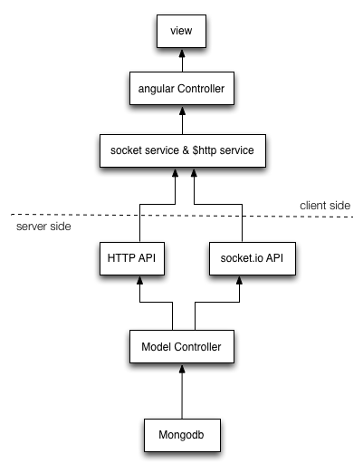
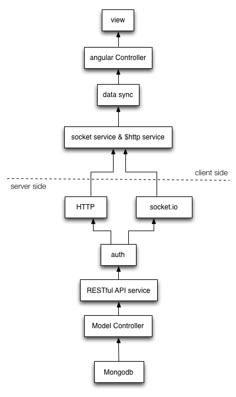

## 架构优化与发布

在本章中，我们将对前三章中一步步编写出来聊天室重新做一次梳理，进行一些优化，让整个项目更容易理解和扩展。其次我们还会介绍一些前端流行的工具，帮助我们构建项目，便于发布。

### 目前的项目结构

目前整个项目的架构如下图：



箭头代表了读取数据的流向，服务端和客户端基本上都分为三层：

- 服务端：在mongodb和mongoose之上，我们添加了一层模型的controller，这一层直接处理一些业务相关的逻辑；在这之上，我们直接通过http API或者socket.io将所提供的接口暴露出来；这一块的代码我们全部写在了app.js中；
- 客户端：针对不同的组件或者页面，我们对应了不同的controller，而这些controller都是通过$http或者socket service直接于服务端通信的；各个controller之间共享数据很困难。

总结一下：

- 将服务端的service逻辑从app.js分拆到http和socket service中
- 在客户端提供一个统一的数据接口层，向上为controller提供数据服务，向下和服务端通信，同步数据。

新的结构应该像下面这样：



### 分拆http和socket服务

首先简化app.js：

```
// ...

var api = require('./services/api')
var socketApi = require('./services/socketApi')

// ...

app.post('/api/login', api.login)
app.get('/api/logout', api.logout)
app.get('/api/validate', api.validate)

// ...

io.sockets.on('connection', function(socket) {

  socketApi.connect(socket)

  socket.on('disconnect', function() {
    socketApi.disconnect(socket)
  })

  socket.on('technode', function(request) {
    socketApi[request.action](request.data, socket, io)
  })
})

// ...
```

我们把http和socket的回调分别放到api.js和socketApi.js中，在socket通信方面做了简化，使用`technode`作为统一的事件名，而需要调用的接口名，则由请求数据中的`action`来决定。每个socket请求都会变成下面这样：

客户端的请求：

```
socket.emit('technode', {
  action: 'getRoom'
})
```

下面是服务端的返回：

```
socket.emit('technode', {
  "action": "getRoom",
  "data": [{
    "name": "Socket.IO",
    "_id": "52b0e5dd0a5e66fa26000001",
    "__v": 0,
    "createAt": "2013-12-18T00:01:33.528Z",
    "users": [],
    "messages": []
  }]
})
```

客户端则根据action，进行不同的处理：

```
socket.on('technode', function (data) {
  switch (data.action) {
      // ...
  }
})
```

而本身api.js和socketApi.js内的处理，与第三章的基本无异，不再细说。

### 客户端缓存

为什么需要客户端缓存？有两点原因：

1. 在第三章的实现中，在房间列表和房间切换时，controller都会通过socket从服务端重新获取房间列表或房间；
2. 在第三章的实现中，我们无法在controller之间共享数据，比如在LoginCtrl中，用户登录后，我们需要更$rootScope的用户信息，我们采用了scope事件机制来实现。

我们需要一个缓存数据和共享数据的组件，这个组件将服务端请求来的数据缓存下来，避免重复的从服务端请求相同的数据，其次是对所有的controller提供接口，让controller可以共享（读取、修改）同一块数据。

我们把这个组件命名为server，与服务端通信完全通过这个组件，数据缓存到这个组件之中，controller直接与它通信，不必关系正真的服务器是什么样的。

```
angular.module('techNodeApp').factory('server', ['$cacheFactory', '$q', '$http', 'socket', function($cacheFactory, $q, $http, socket) {
  var cache = window.cache = $cacheFactory('technode')
  socket.on('technode', function(data) {
    switch (data.action) {
      case 'getRoom':
        if (data._roomId) {
          angular.extend(cache.get(data._roomId), data.data)
        } else {
          data.data.forEach(function (room) {
            cache.get('rooms').push(room)
          })
        }
        break
      // case something else
      // handle for socket events
    }
  })

  socket.on('err', function (data) {
    // handle server err
  })

  return {
    validate: function() {
      var deferred = $q.defer()
      $http({
        url: '/api/validate',
        method: 'GET'
      }).success(function(user) {
        angular.extend(cache.get('user'), user)
        deferred.resolve()
      }).error(function(data) {
        deferred.reject()
      })
      return deferred.promise
    }
    // more API
  }
}])
```

在server中，我们使用两个Angular.js提供的组件，`$q`和`$cacheFactory`。

#### $q

$q是Angular.js对JavaScript异步变成模式Promise的实现，参考了https://github.com/kriskowal/q 。在TechNode对它的用法相对比较简单，仅仅是将ajax请求隐藏起来。以server.validate为例：


```
validate: function() {
  var deferred = $q.defer()
  $http({
    url: '/api/validate',
    method: 'GET'
  }).success(function(user) {
    angular.extend(cache.get('user'), user)
    deferred.resolve()
  }).error(function(data) {
    deferred.reject()
  })
  return deferred.promise
}
```

`$q.defer()`获取一个differed（推迟）对象，然后`return deferred.promise`先返回promise（承诺），在服务器端成功返回后，resolve（兑现）承诺，或者遇到问题，reject（拒绝）兑现。

在technode.js中我们可以这样使用：

```
server.validate().then(function() {
  if ($location.path() === '/login') {
    $location.path('/rooms')
  }
}, function() {
  $location.path('/login')
})
```

`server.validate()`获取promise（承诺）对象，then(resolvedCallback, rejectCallack)（然后）根据承诺的兑现情况进行不同的处理。

换句话说，technode.js中的`techNodeApp`问server，用户是不是登录了，server必须调用服务端接口进行验证，因此server给`techNodeApp`许诺，`techNodeApp`则只需要针对许诺是否兑现进行处理就好了。

所有与http请求相关的接口，我们都做了相似的处理。

#### $cacheFactory

$cacheFactory是Angular提供的缓存组件，该组件直接将数据存放在内存中。

```
var cache = window.cache = $cacheFactory('technode')

// ...

cache.put('rooms', [])

// ...

cache.get('rooms') && cache.get('rooms').forEach(function(room) {
  if (room._id === _roomId) {
    room.users = room.users.filter(function(user) {
      return user._id !== _userId
    })
  }
})
```

直接调用$cacheFactory，传入cacheId，Angular就为我构造出一块缓存区域，我们就可以通过get、put等等方法来存储或者获取缓存数据了。

$cacheFactory提供了一种TechNode中未使用的特性，即这块缓存可以是LRU的，即这块缓存是有大小的（避免缓存太大了，影响了性能），并且这块缓存使用LRU算法来淘汰长时间未使用的数据。

### controller与server

有了server，我们来看看controller有合变化？这是原来的RoomCtrl的代码：

```
angular.module('techNodeApp').controller('RoomCtrl', function($scope, $routeParams, $scope, socket) {
  socket.on('rooms.read.' + $routeParams._roomId, function(room) {
    $scope.room = room
  })
  socket.emit('rooms.read', {
    _roomId: $routeParams._roomId
  })
  socket.on('messages.add', function(message) {
    $scope.room.messages.push(message)
  })
  // ...
  socket.on('users.join', function (join) {
    $scope.room.users.push(join.user)
  })

  socket.on('users.leave', function(leave) {
    _userId = leave.user._id
    $scope.room.users = $scope.room.users.filter(function(user) {
      return user._id != _userId
    })
  })
})
```

这是基于server组件修改后的RoomCtrl：

```
angular.module('techNodeApp').controller('RoomCtrl', ['$scope', '$routeParams', '$scope', 'server', function($scope, $routeParams, $scope, server) {

  $scope.room = server.getRoom($routeParams._roomId)

  // ...
}])
```

- RoomCtrl不再直接于服务端通信读取当前的房间信息
- 无需监听用户进入或者离开，监听新消息

RoomCtrl只需调用server.getRoom，传入房间的id即可。那房间信息不是需要到服务端读取么？这是怎么实现的？

这完全得益于Angular数据绑定特性，即数据变化，视图也会跟着变化：

```
getRoom: function(_roomId) {
  if (!cache.get(_roomId)) {
    cache.put(_roomId, {
      users: [],
      messages: []
    })
    socket.emit('technode', {
      action: 'getRoom',
      data: {
        _roomId: _roomId
      }
    })
  }
  return cache.get(_roomId)
}
```

这里的处理方式与`promise`有异曲同工之妙，`getRoom`方法，如果在缓存中没有找到房间的数据，就先放入一个房间对象，不过里面的数据都是空的（此时，RoomCtrl渲染出来的是一个空的房间视图），然后通过socket向服务端请求房间数据；如果找到就直接返回从缓存中获取的房间数据，RoomCtrl就可以渲染出来一个正常的房间视图。

而在服务端返回房间信息后，

```
case 'getRoom':
  if (data._roomId) {
    angular.extend(cache.get(data._roomId), data.data)
  } else {
    data.data.forEach(function (room) {
      cache.get('rooms').push(room)
    })
  }
```

我们使用服务端的数据扩展空房间即可，Angular即根据数据的变化，渲染出新的房间视图。

> 我们必须保证更新的房间对象必须是视图绑定的对象，因此我们一开始就返回一个房间对象，后面只是修改这个对象的属性。

同理，RoomCtrl也无需出来用户进入或者离开房间，有新消息这类事件，因为server组件会自动更新对应的数据，RoomCtrl只需要按照数据渲染即可。

好了，我们利用客户端缓存和Angular数据绑定特性，大大简化了TechNode控制器层。到此，我们的开发之旅已经接近尾声，接下来，我们将学习如何将前端程序打包，发布！

### 使用Grunt打包TechNode

开发时，为了解耦和便于维护，我们把代码拆成单独的文件，JavaScript代码、CSS代码和HTML都是单独的。在生产环境中，为了提高性能，我们需要把这些分开的文件合并到一起。如果你的网站使用CDN的化，我们还需要给每个文件，添加上唯一的标示，便于处理CDN的缓存。

Grunt是目前JavaScript最流行的项目自动化构建工具。Grunt官方提供了很多插件，也有大量的第三方插件。我们可以轻松地使用Grunt检查、压缩合并代码，甚至发布应用程序。我们将基于grunt-usemin等几个流行的Grunt插件来构建TechNode项目。

首先我们需要做一些准备，安装Grunt命令行和运行时，在TechNode根目录新建Gruntfile.js。

```
npm install -g grunt-cli && npm install grunt --save-dev && touch Gruntfile.js
```

为了使用grunt-usemin来压缩我们的代码，我们需要在index.html添加一些特殊的注释来来帮助grunt-usemin找到要合并的文件：

```
<!-- build:css /css/technode.css -->
<link rel="stylesheet" href="/components/bootstrap/dist/css/bootstrap.min.css">
<link rel="stylesheet" href="/styles/style.css">
<link rel="stylesheet" href="/styles/login.css">
<link rel="stylesheet" href="/styles/rooms.css">
<link rel="stylesheet" href="/styles/room.css">
<!-- endbuild -->

<script type="text/javascript" src="/socket.io/socket.io.js"></script>
<!-- build:js /script/technode.js -->
<script type="text/javascript" src="/components/jquery/jquery.js"></script>
<script type="text/javascript" src="/components/bootstrap/dist/js/bootstrap.min.js"></script>
<script type="text/javascript" src="/components/angular/angular.js"></script>
<script type="text/javascript" src="/components/angular-route/angular-route.js"></script>
<script type="text/javascript" src="/components/moment/moment.js"></script>
<script type="text/javascript" src="/components/angular-moment/angular-moment.js"></script>
<script type="text/javascript" src="/components/moment/lang/zh-cn.js"></script>
<script type="text/javascript" src="/technode.js"></script>
<script type="text/javascript" src="/services/socket.js"></script>
<script type="text/javascript" src="/services/server.js"></script>
<script type="text/javascript" src="/router.js"></script>
<script type="text/javascript" src="/directives/auto-scroll-to-bottom.js"></script>
<script type="text/javascript" src="/directives/ctrl-enter-break-line.js"></script>
<script type="text/javascript" src="/controllers/login.js"></script>
<script type="text/javascript" src="/controllers/rooms.js"></script>
<script type="text/javascript" src="/controllers/room.js"></script>
<script type="text/javascript" src="/controllers/message-creator.js"></script>
<!-- endbuild -->
```

我们分别在css和javascript的引用周围加上了注释，`<!-- build:css /css/technode.css -->`标示我们需要把下面这些css都合并到technode.css这个文件中。同理javascript全都合并到technode.js中。

> 注意，socket.io.js这个文件并没有包含进来，因为它是socket.io自己输入的，并没有在我们的自己的源码中。当然，我们甚至可以把这个文件保存到源码中，自己引用也是可以的。

首先使用grunt-contrib-copy将不需要打包压缩的文件拷贝到build目录中，修改Gruntfile.js

```
module.exports = function (grunt) {
  grunt.initConfig({
    copy: {
      main: {
        files: [
          {expand: true, cwd: 'static/components/bootstrap/dist/fonts/', src: ['**'], dest: 'build/fonts'},
          {'build/index.html': 'static/index.html'},
          {'build/favicon.ico': 'static/favicon.ico'}
        ]
      }
    }
  })
  grunt.loadNpmTasks('grunt-contrib-copy')

  grunt.registerTask('default', [
    'copy'
  ])
}
```

grunt-usemin为我们提供了一个useminPrepare的task，这个task就是基于我们在index.html文件中的配置自动生成合并和压缩代码的配置：

```
module.exports = function (grunt) {
  grunt.initConfig({
    copy: {
      main: {
        files: [
          {expand: true, cwd: 'static/components/bootstrap/dist/fonts/', src: ['**'], dest: 'build/fonts'},
          {'build/index.html': 'static/index.html'},
          {'build/favicon.ico': 'static/favicon.ico'}
        ]
      }
    },
    useminPrepare: {
      html: 'static/index.html',
      options: {
        dest: 'build'
      }
    }
  })
  grunt.loadNpmTasks('grunt-usemin')
  grunt.loadNpmTasks('grunt-contrib-copy')

  grunt.registerTask('default', [
    'copy',
    'useminPrepare'
  ])
}
```

`npm install grunt-usemin --save-dev`，运行`grunt`试试看：

```
Running "useminPrepare:html" (useminPrepare) task
Going through static/index.html to update the config
Looking for build script HTML comment blocks

Configuration is now:

  concat:
  { generated: 
   { files: 
      [ { dest: '.tmp/concat/css/technode.css',
          src: 
           [ 'static/components/bootstrap/dist/css/bootstrap.min.css',
             'static/styles/style.css',
             'static/styles/login.css',
             'static/styles/rooms.css',
             'static/styles/room.css' ] },
        { dest: '.tmp/concat/script/technode.js',
          src: 
           [ 'static/components/jquery/jquery.js',
             'static/components/bootstrap/dist/js/bootstrap.min.js',
             'static/components/angular/angular.js',
             'static/components/angular-route/angular-route.js',
             'static/components/moment/moment.js',
             'static/components/angular-moment/angular-moment.js',
             'static/components/moment/lang/zh-cn.js',
             'static/technode.js',
             'static/services/socket.js',
             'static/services/server.js',
             'static/router.js',
             'static/directives/auto-scroll-to-bottom.js',
             'static/directives/ctrl-enter-break-line.js',
             'static/controllers/login.js',
             'static/controllers/rooms.js',
             'static/controllers/room.js',
             'static/controllers/message-creator.js' ] } ] } }

  uglify:
  { generated: 
   { files: 
      [ { dest: 'build/script/technode.js',
          src: [ '.tmp/concat/script/technode.js' ] } ] } }

  cssmin:
  { generated: 
   { files: 
      [ { dest: 'build/css/technode.css',
          src: [ '.tmp/concat/css/technode.css' ] } ] } }
```

它为我们生成好了，本来需要手动编写的其他grunt task的配置，接下来，安装其他几个需要的grunt task，继续修改Gruntfile.js：

```
module.exports = function (grunt) {
  grunt.initConfig({
    copy: {
      main: {
        files: [
          {expand: true, cwd: 'static/components/bootstrap/dist/fonts/', src: ['**'], dest: 'build/fonts'},
          {'build/index.html': 'static/index.html'},
          {'build/favicon.ico': 'static/favicon.ico'}
        ]
      }
    },
    useminPrepare: {
      html: 'static/index.html',
      options: {
        dest: 'build'
      }
    }
  })
  grunt.loadNpmTasks('grunt-usemin')
  grunt.loadNpmTasks('grunt-contrib-copy')
  grunt.loadNpmTasks('grunt-contrib-concat')
  grunt.loadNpmTasks('grunt-contrib-uglify')
  grunt.loadNpmTasks('grunt-contrib-cssmin')

  grunt.registerTask('default', [
    'copy',
    'useminPrepare',
    'concat',
    'uglify',
    'cssmin'
  ])
}
```

安装好新的依赖，再运行grunt试试看。首先concat根据useminPrepare生成的配置，将css和js分别合并成了.tmp/concat/css/technode.css和.tmp/concat/script/technode.js；然后uglify和cssmin分别将这两个文件压缩成了build/css/technode.css和build/script/technode.js，我们的css文件和js文件就打包压缩好了。

除此之外我们还需要把pages中的html内联到index.html中。在Angular.js中，我们既可以将模板文件单独放在不同的html文件中，也可以像下面这样，内联在html中：

```
<script type="text/ng-template" id="/pages/login.html">
<form class="form-inline form-login" ng-submit="login()">
  <div class="form-group">
    <label class="sr-only">Gmail</label>
    <input type="email" required class="form-control" ng-model="email" placeholder="Gmail账号" />
  </div>
  <button type="submit" class="btn btn-primary btn-enter">进入</button>
</form>
</script>
```

`grunt-inline-angular-templates`就可以实现这样的需求：

```
inline_angular_templates: {
  dist: {
      options: {
          base: 'static/',
          prefix: '/'
      },
      files: {
          'build/index.html': ['static/pages/*.html']
      }
  }
}
```

使用grunt-rev，为静态文件加上唯一标示，使用grunt-contrib-clean在每次打包开始时，清除.tmp和build里的内容：

```
rev: {
  options: {
    encoding: 'utf8',
    algorithm: 'md5',
    length: 8
  },
  assets: {
    files: [{
      src: [
        'build/**/*.{jpg,jpeg,gif,png,js,css,eot,svg,ttf,woff}'
      ]
    }]
  }
},
clean: {
  main:['.tmp', 'build']
}
```

最后，使用grunt-usemin提供的task usemin，将html中标记的合并区块已经css中的字体引用使用build目录中对应的压缩做了唯一标记的文件名替换掉：

```
grunt.registerTask('default', [
  'clean',
  'copy',
  'useminPrepare',
  'concat',
  'uglify',
  'cssmin',
  'rev',
  'usemin',
  'inline_angular_templates'
])
```

于是我们整个构建的过程结束了，所有文件都按照我们想要的方式处理好了。

我们再来回顾一下打包的过程，开始那么多的js，首先被concat到了tmp/concat/technode.js中，然后aglify压缩到build/script/tecnhode.js中，接着rev根据文件内容为其生成了唯一的标示`7add9650.technode.js`，最后，usemin再把build/index.html中的js区块换成了`<script src="/script/7add9650.technode.js"></script>`。这就是我们采用的整个打包压缩过程。同理css也是如此。

### 发布

发布之前我们还需要做一些准备工作，我们需要让生产环境中访问的是打包压缩过的静态文件，express为我们提供了一种区分开发环境和声场环境的方式：

```
app.configure('development', function () {
  app.set('staticPath', '/static')
})

app.configure('production', function () {
  app.set('staticPath', '/build')
})

app.use(express.static(__dirname + app.get('staticPath')))
```

如果我们运行`node app.js` express木人采用的是development环境，我们可以使用`NODE_ENV=production node app.js`来启用生产环境的配置，我们这里的做法很简单，将静态文件的路径指定到编译后的/build目录即可。

至于如何部署到线上，我不再多提，大家可以参考[《使用 Express + MongoDB 搭建多人博客》番外篇之——部署到 Heroku](https://github.com/nswbmw/N-blog/wiki/%E7%95%AA%E5%A4%96%E7%AF%87%E4%B9%8B%E2%80%94%E2%80%94%E9%83%A8%E7%BD%B2%E5%88%B0-Heroku)将TechNode部署到heroku上。注意一下两点即可：

- 修改config.js中的mongdb配置，修改成对应的你在mongohq的数据库，例如：`mongodb://<user>:<password>@troup.mongohq.com:10046/technode`
- 修改heroku对应的Procfile文件，添加`web: NODE_ENV=production node app.js`，让TechNode已生产模式启动。

大家可以访问http://technode.herokuapp.com/（也可以通过www.technode.im来访问），测试我部署在heroku上的TechNode。

### 聊天室之旅结束啦！

到这里，我们的聊天室之旅告一段落。TechNode虽然还有很多不足之处，但是我希望，你看完这几章之后，能够有所收获。相信你现在一定能够使用Node.js、socket.io、Angular.js等等这些现在炙手可热的框架来快速搭建一个Web应用吧！赶紧计划自己的下一个项目吧，如果有进展，可别忘了告诉我！


